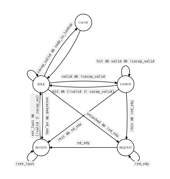

# Cache

## 概述

## 缓存一致性

由于设计的是单核系统，因此可以不将缓存一致性结点设置为内存（强序非缓存区域除外）；

缓存一致性结点为 L1 DCache（即可缓存区 L1 DCache 中的数据始终是最新数据）。对于自修改指令，应先冲刷 L1 DCache，然后冲刷 L1 ICache；

## ICache

阻塞式缓存，请求一定顺序执行。

### 接口

ICache 只支持读取和 CACOP 操作。读取时，一次性返回给定地址 16 字节对齐的 4 条指令。共有 4 个通道：`control (c)`, `read address (ar)`, `read data (r)` 和 `cacop`。

#### `control (c)`

控制读通道的握手信号；

| I/O 	| 信号    	| 位宽 	| 含义                                                              	|
|-----	|---------	|------	|-------------------------------------------------------------------	|
| I   	| `valid` 	| 1    	| `ar` 通道请求有效；使用者不能依靠 `ready` 生成 `valid` 	|
| O   	| `ready` 	| 1    	| 请求被接受；在 Cache 中，可能会根据 `valid` 生成 `ready`          	|

#### `read address (ar)`

当前，即使是 Uncached 访存，ICache 仍然会从给定 `araddr` 16 字节对齐处连续取出 16 字节返回给上层；

| I/O 	| 信号       	| 位宽 	| 含义                   	|
|-----	|------------	|------	|------------------------	|
| I   	| `araddr`   	| 32   	| PA                     	|
| I   	| `uncached` 	| 1    	| 非缓存(1) 可缓存(0) 	|

#### `read data (r)`

当前请求结果返回。

| I/O 	| 信号   	| 位宽 	| 含义                                               	|
|-----	|--------	|------	|----------------------------------------------------	|
| O   	| `rvalid` 	| 1    	| 返回结果有效                                       	|
| O   	| `rdata`  	| 128  	| 从 `araddr & $signed(0xf0)` 位置开始的连续 16 字节 	|
| O     | `rhit`    | 1     | 当前返回的结果是否是命中的                             | 

#### `cacop`

| I/O 	| 信号         	| 位宽 	| 含义                                                                                             	|
|-----	|--------------	|------	|--------------------------------------------------------------------------------------------------	|
| I     | `cacop_valid`    | 1     | 握手信号需要遵循的规则同读写通道 |
| O     | `cacop_ready` | 1     |  |
| I   	| `cacop_code` 	| 2    	| 即 `cacop` 指令中的 `code[4:3]`                                                                  	|
| I   	| `cacop_addr` 	| 32   	| 即 `cacop` 指令使用的地址，如果是 `code[4:3] == 2` （查表命中则无效）的情况，该地址已经转换为 PA 	|

> **注意**: 请在 CACOP 指令阻塞时也将 `cacop_valid` 置 1，这样 Cache 能够尽快返回到能处理 CACOP 请求的状态，而不是接着处理下一个读/写请求（其实只要满足了握手信号的要求，这个条件应该已经满足）；

### 版本

#### `icache_dummy`

读操作均为 Uncached，每次读取都会直接访问总线，采用了最为简单的设计，第一拍寄存请求，第二拍发起总线请求，然后接收持续若干拍，最后一拍将缓存内容和最后一拍的数据合起来返回；

#### `icache_dummy_v2`

能够连续不断地处理请求（虽然都是 Miss），即能够在 `state_receive` 直接处理新请求，虽然不满足全功能 ICache 的时序（至少 1 拍），但由于非缓存时总线延时至少 1 拍，更好地满足了完全非缓存的测试需求；

`icache_dumy` 和 `icache_dummy_v2` 在 CACOP 查索引请求的时序上和其他版本不同（其他版本需要延迟一个周期，这两个直接忽略）；

#### `icache_v2`

第一个接口匹配，功能完善（支持 Uncached 和 CACOP）的 Cache；

大小为 4KB，直接映射，256 行，每行 16 B；

#### `icache_v3`

大小 8KB，2 路组相连，256 行，每行 16B，随机替换；

#### `icache_v4`

大小 8KB，2 路组相连，256 行，每行 16B，LRU 替换；

#### `icache_v5`

- 在 `state_lookup` 阶段如果 `hit`，接受新请求，不返回 `state_idle` 再重新接受请求；

    > 直到 `icache_v4` 都有一个问题，即不能连续处理请求，如果在 `state_lookup` 命中情况下应该可以继续留在 `state_lookup`，而不需要回到 `state_idle`；

- 添加性能计数器接口；

##### 规格

8KB, 2-way, 256 lines, 16B/line (4 insts), LRU/Random replace.

##### 状态

- 能够在 `IDLE`, `LOOKUP (hit)` 时接受 R/W 请求；
- 对于 Uncached R/W 请求，直接与 AXI Bridge 握手，进入对应的接收状态；
- 对于 CACOP 请求，必须回到 `IDLE` 状态接受，优先接受 CACOP 请求；

##### Cache 控制

在 `IDLE`, `LOOKUP (hit)` 状态下同时读 `tagv_sram` 和 `data_sram`，在 `RECEIVE (recv_fin)` 状态写 `tagv_sram` 和 `data_sram`；

## DCache

### 接口

#### 流水线请求端

| I/O 	| 信号     	| 位宽 	| 含义                                                                               	|
|-----	|----------	|------	|------------------------------------------------------------------------------------	|
| I   	| `op`       	| 1    	| 读: 0, 写: 1                                                                       	|
| I   	| `strb`     	| 4    	| 操作的字节使能信息，为 4B 对齐地址开始的 4B 的字节使能 注意读操作也需要字节使能 	|
| I   	| `uncached` 	| 1    	| 操作是否为 Uncached                                                                	|
| I   	| `wdata`    	| 32   	| 写操作的数据                                                                       	|

#### 流水线接收端

| I/O 	| 信号   	| 位宽 	| 含义                        	|
|-----	|--------	|------	|-----------------------------	|
| O   	| `rvalid` 	| 1    	|                             	|
| O   	| `rdata`  	| 32   	|                             	|
| O   	| `rhit`   	| 1    	| 读请求是否命中，持续 1 周期 	|
| O   	| `whit`   	| 1    	| 写请求是否命中，持续 1 周期 	|

#### CACOP 端

| I/O 	| 信号          	| 位宽 	| 含义                        	|
|-----	|---------------	|------	|-----------------------------	|
| I   	| `cacop_valid` 	| 1    	| CACOP 端口握手信号          	|
| O   	| `cacop_ready` 	| 1    	|                             	|
| I   	| `cacop_code`  	| 2    	| 即 CACOP 指令的 `code[3:2]` 	|
| I   	| `cacop_addr`  	| 32   	|                             	|

### 版本

#### `dcache_dummy_v3`

带有 Uncached 访问，且支持所有规格访存，且能够和 AXI Bridge 直接握手的 Dummy DCache;

#### `dcache_v4`

##### 规格

8/16KB, 2/4-way, 256 lines, 16B/line, 4 banks, Random/LRU replace;

第一代全功能、支持参数化配置的 DCache，能够通过修改 `DCACHE_WAY=2/4`, 定义宏 `DCACHE_LRU` 选择路数、替换策略；

##### 状态

- Uncached 请求和 CACOP 请求会使 DCache 尽快返回 IDLE 状态，以便流水线和 AXI Bridge 直接握手；

##### Cache 控制

- 在 `IDLE`, `LOOKUP (hit)`, `REQW (wr_rdy)` 时读取 `tagv_sram`；
- 在 Write Buffer `WRITE` 状态写对应 Bank；
