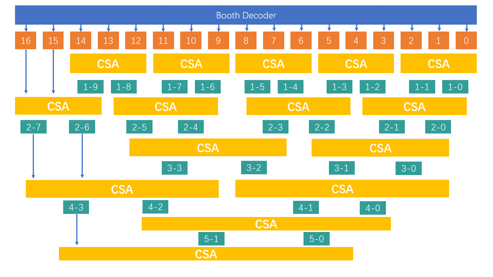

### 乘法器模块设计

|  接口           |      简介     |
|----------------|--------------|
|    clk         |    系统时钟   |
|     x[31:0]    |    乘数       |
|     x[31:0]    |    乘数       |
|    en          |   使能信号    |
|mul_signed      | 带有符号乘法  |
|mul_high        |    高位结果   |
|mul_result[31:0]|    运算结果   |
|mul_ok          |   计算结束信号|

#### 部分积生成

考虑到基2-Booth算法的部分积生成数量过多，总体收益不高，乘法器采用了基4-Booth的部分积生成算法，具体匹配规则如下。

| $x_{i+1}x_ix_{i-1}$  |  部分积  |
|----------------------|----------|
|  $000$               |    $0$   |
|  $001$               |    $+1$  |
|  $010$               |    $+1$  |
|  $011$               |    $+2$  |
|  $100$               |    $-2$  |
|  $101$               |    $-1$  |
|  $110$               |    $-1$  |
|  $111$               |    $0$   |

#### Wallace树

通过部分积，就可以通过加法运算去获得运算结果，注意在这里可以采用树状结构的CSA(Carry Save Adder)进行加法的压缩，缩短计算的逻辑延时，结构如下图所示

